# รายงานผล Part 1 — YOLOv5 Box Detection

## 1. วัตถุประสงค์

ทดลองฝึกโมเดล YOLOv5n สำหรับตรวจจับ bounding box ของ `lane`, `track-line` และ `sideway`
ด้วยชุดข้อมูล 4 ขนาด เพื่อศึกษาผลของจำนวนข้อมูลต่อ loss, convergence และประสิทธิภาพบน test set
พร้อมบันทึก total loss, component losses และ learning rate ระดับ iteration ตามข้อกำหนดในสไลด์หน้า 17–19

## 2. การจัดเตรียมข้อมูล

สร้างชุดข้อมูลแบบ deterministic nested subsets ด้วย seed 2569 ชุดที่เล็กกว่าจะเป็นส่วนหนึ่งของชุดที่ใหญ่กว่า
ภายใน split เดียวกัน ทำให้เปรียบเทียบผลจากการเพิ่มจำนวนข้อมูลได้โดยไม่สุ่มตัวอย่างคนละแบบ

| Dataset | Train | Validation | Test | จำนวนภาพรวม |
| --- | ---: | ---: | ---: | ---: |
| `f09_box_30` | 22 | 4 | 4 | 30 |
| `f09_box_60` | 42 | 9 | 9 | 60 |
| `f09_box_150` | 108 | 21 | 21 | 150 |
| `f09_box_350` | 250 | 50 | 50 | 350 |

สไลด์ยกตัวอย่างการแบ่ง train 100/test 100 แต่งานทดลองนี้ใช้ข้อมูลที่มีอยู่ทั้งหมดโดยเพิ่ม validation split
และใช้ชุดใหญ่สุดเป็น train/validation/test เท่ากับ 250/50/50 ภาพ ส่วนการเปรียบเทียบโมเดลใช้ test split
50 ภาพชุดเดียวกัน ซึ่งไม่ถูกนำไปใช้ฝึกโมเดล

## 3. การตั้งค่าการทดลอง

ควบคุมค่าต่อไปนี้ให้เหมือนกันทุก run และเปลี่ยนเฉพาะขนาด dataset:

| รายการ | ค่า |
| --- | --- |
| Model | YOLOv5n pretrained weights (`yolov5n.pt`) |
| Epochs | 30 |
| Batch size | 2 |
| Image size | 640 × 640 |
| Device | CPU |
| Workers | 0 |
| Seed | 2569 |
| Optimizer | SGD |
| Hyperparameters | `data/hyps/hyp.scratch-low.yaml` |

ก่อนรันจริงได้ทำ preflight บน dataset 30 จำนวน 1 epoch พบว่า TensorBoard tags ทั้งห้ามี 11 steps
ครบตามจำนวน batches, ไม่มี NaN/Inf และ total loss เท่ากับผลรวม box, objectness และ classification loss
ภายใน tolerance ของ floating-point

## 4. ผลการฝึกและการตรวจ TensorBoard events

| Dataset | Training iterations | Best epoch | Best validation mAP50-95 | Event verification |
| ---: | ---: | ---: | ---: | --- |
| 30 | 330 | 28 | 0.09685 | ผ่าน |
| 60 | 630 | 18 | 0.33475 | ผ่าน |
| 150 | 1,620 | 28 | 0.70766 | ผ่าน |
| 350 | 3,750 | 29 | 0.81224 | ผ่าน |

ทุก run มี iteration steps ต่อเนื่องตั้งแต่ 0, ค่าทั้งหมดเป็น finite, มี 30 แถวใน `results.csv`
และมีทั้ง `best.pt` กับ `last.pt` โดยตรวจว่า `train/total_loss` เท่ากับผลรวมของ
`train/box_loss_iter`, `train/obj_loss_iter` และ `train/cls_loss_iter`

### ภาพรวม TensorBoard

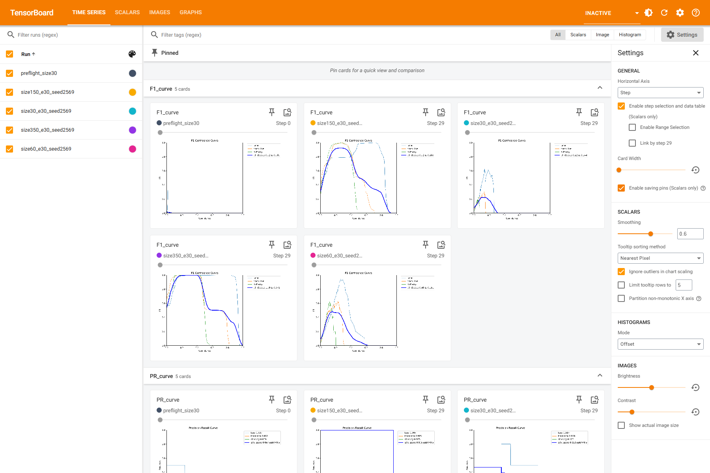

### Component losses ระดับ iteration

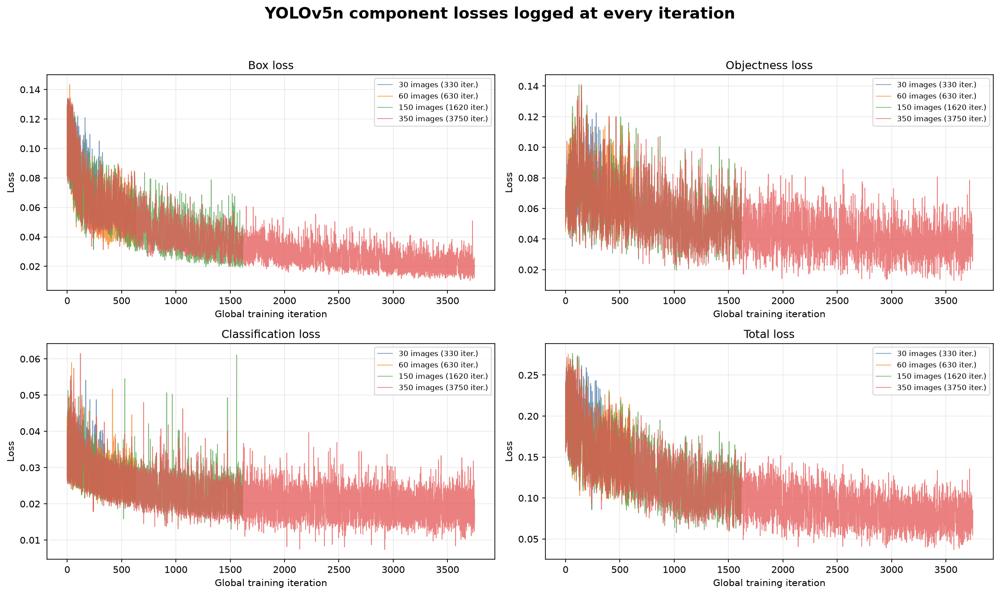

### Validation metrics

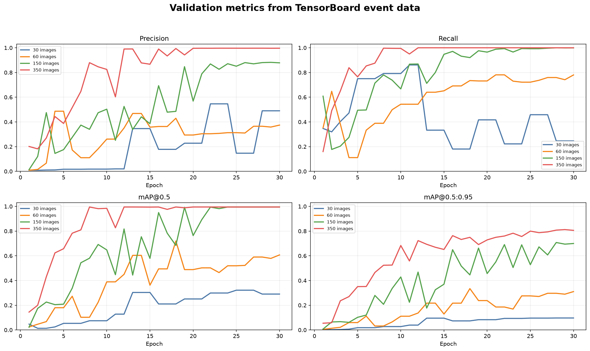

### Learning-rate schedule

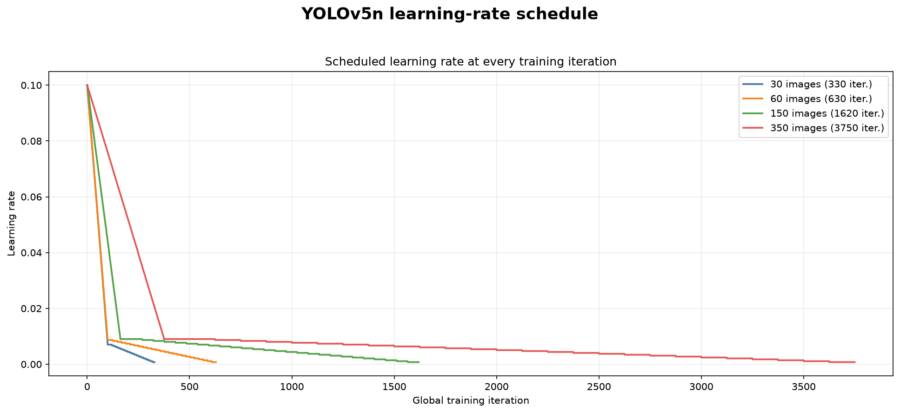

## 5. ผลประเมินบน common test set

นำ `best.pt` ของทุก run ไปประเมินบน test split เดียวกันจำนวน 50 ภาพและ 351 objects
เพื่อไม่ให้คะแนนได้รับผลจากจำนวนหรือความยากของ test set ที่ต่างกัน

| Dataset | Precision | Recall | mAP50 | mAP50-95 |
| ---: | ---: | ---: | ---: | ---: |
| 30 | 0.141 | 0.318 | 0.212 | 0.0706 |
| 60 | 0.365 | 0.708 | 0.546 | 0.2490 |
| 150 | 0.886 | 0.987 | 0.984 | 0.6520 |
| 350 | **0.990** | **0.990** | **0.989** | **0.7250** |

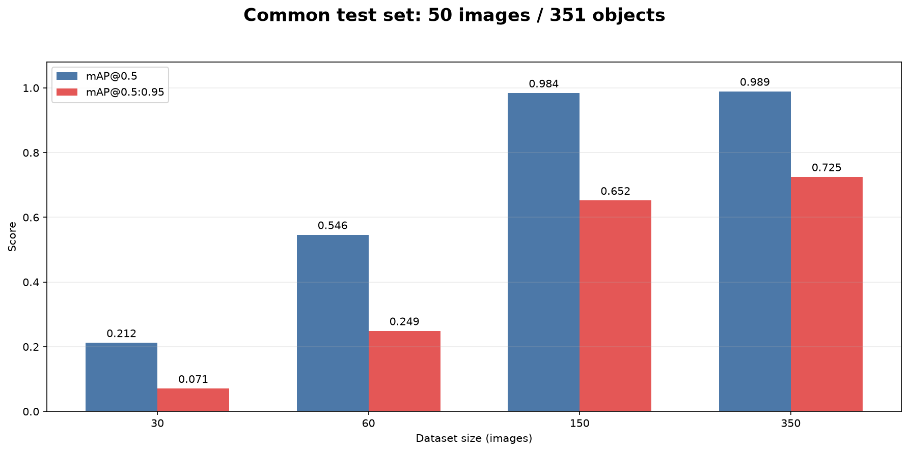

ผลแสดงว่าประสิทธิภาพเพิ่มขึ้นตามจำนวนข้อมูล โดยช่วงที่เพิ่มจาก 60 เป็น 150 ภาพให้การเปลี่ยนแปลงมากที่สุด
โมเดลจาก dataset 350 มี common-test mAP50-95 สูงสุดเท่ากับ 0.7250 จึงถูกเลือกเป็น final model

## 6. ผลแยกตามรอบการฝึก

### Dataset 30

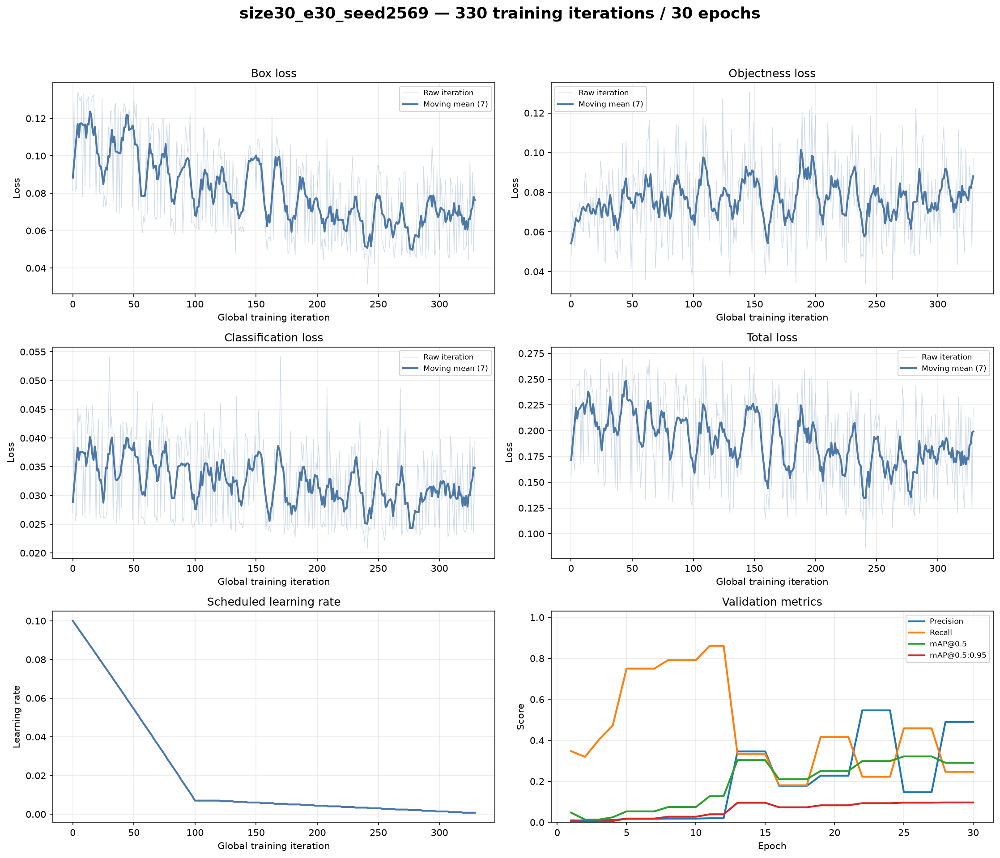

### Dataset 60

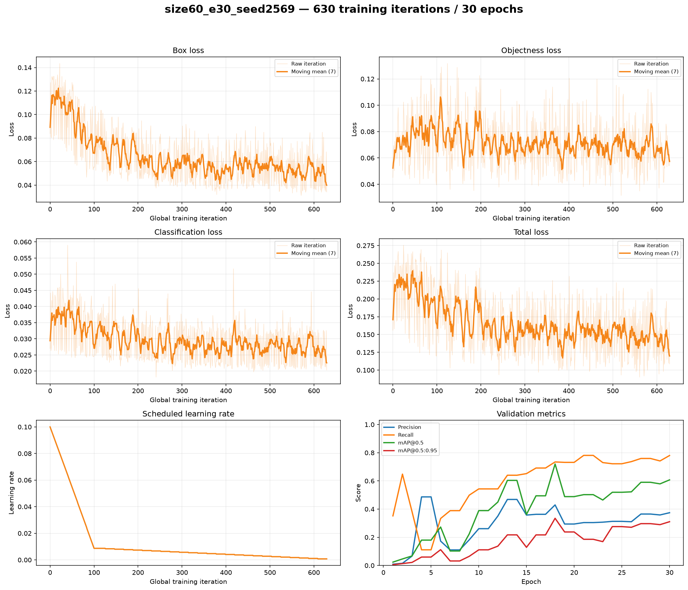

### Dataset 150

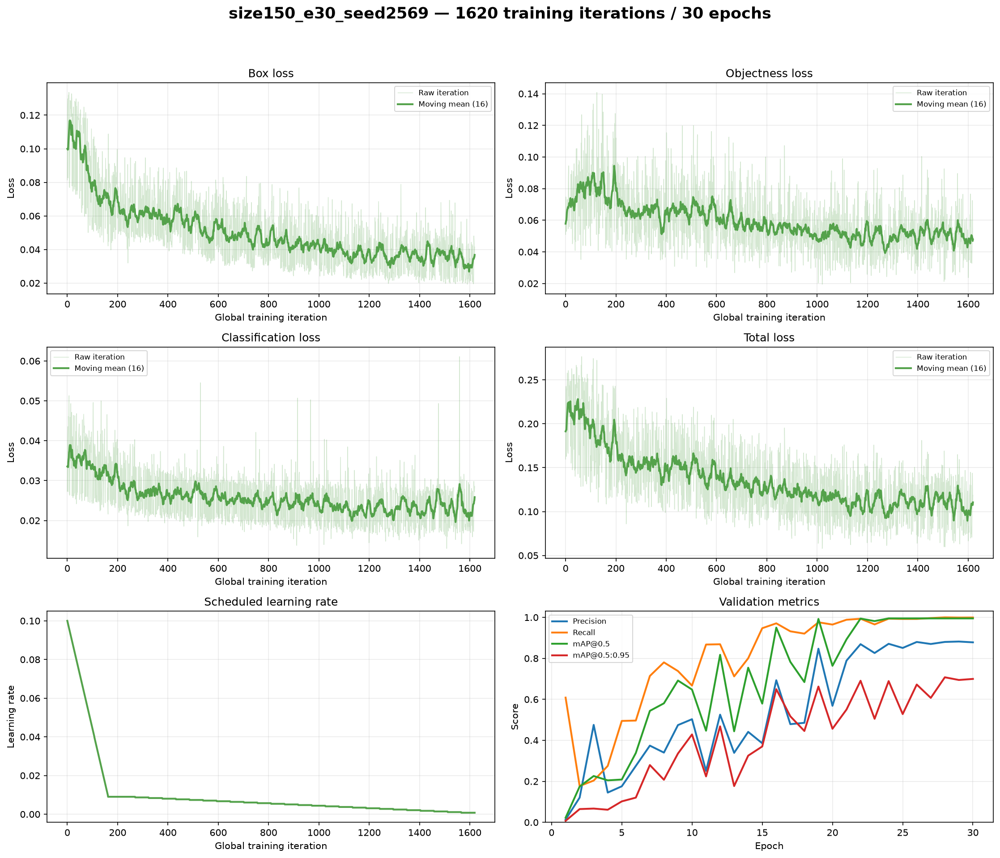

### Dataset 350

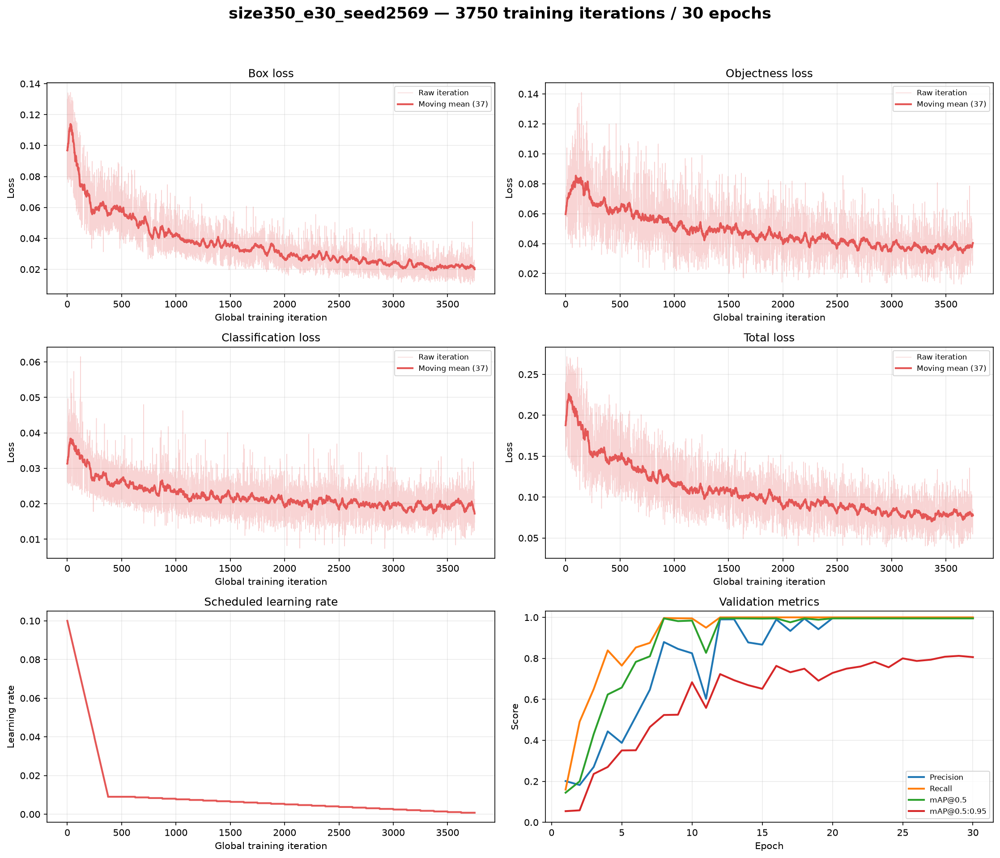

กราฟ `results.png` ต้นฉบับของ YOLOv5 สำหรับทั้งสี่ run อยู่ใน `screenshots/per_run/` เช่นกัน

## 7. ตัวอย่าง inference จาก final model

เลือกตัวอย่างจากตำแหน่งต้น กลาง และท้ายของ test split โดยใช้โมเดล size-350 และ confidence threshold 0.25

### ตัวอย่างต้นลำดับ

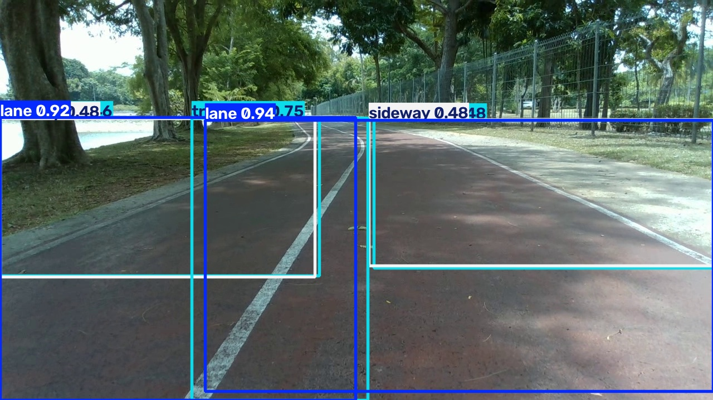

ตรวจพบ lane 2 บริเวณ, track-line 3 บริเวณ และ sideway 2 บริเวณ ครอบคลุมพื้นที่หลักตาม annotation

### ตัวอย่างกลางลำดับ

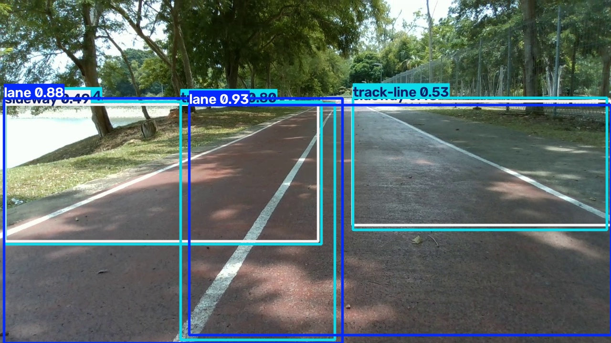

ตรวจพบโครงสร้างถนนหลักครบ แต่บริเวณด้านขวาหนึ่งตำแหน่งถูกจัดเป็น track-line ด้วยความมั่นใจต่ำกว่า
ตัวอย่างต้นและท้าย แสดงถึงความคลาดเคลื่อนที่ยังเหลืออยู่ใน final model

### ตัวอย่างท้ายลำดับ

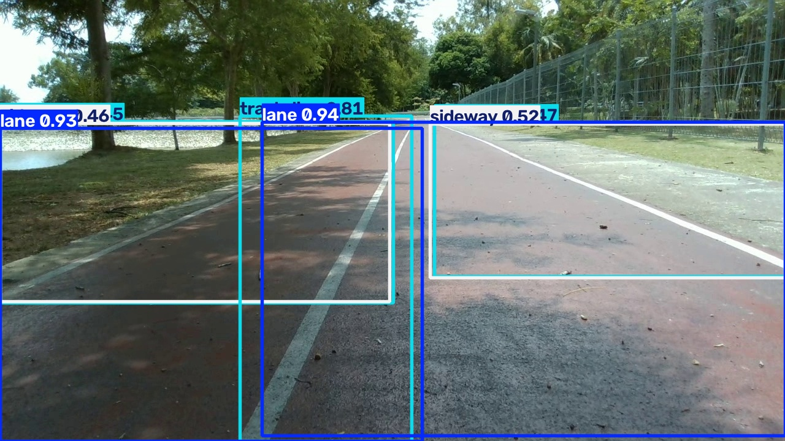

ตรวจพบ lane 2 บริเวณ, track-line 3 บริเวณ และ sideway 2 บริเวณ โดยตำแหน่งกรอบสอดคล้องกับตัวอย่างต้นลำดับ

กรอบหลายกรอบซ้อนกันมากเนื่องจาก annotation ของ dataset กำหนดพื้นที่ขนาดใหญ่ที่ซ้อนทับกัน

## 8. การวิเคราะห์ convergence

โมเดล size-350 มีแนวโน้ม converge เนื่องจาก box, objectness, classification และ total losses ลดลงต่อเนื่อง
ขณะที่ precision, recall และ mAP เพิ่มขึ้นและเริ่มคงที่ในช่วงท้าย ผล validation ที่ดีที่สุดเกิดใน epoch 29
โดยได้ precision 0.99625, recall 1.0, mAP50 0.995 และ mAP50-95 0.81224

ผล common test ของ final model ได้ precision 0.990, recall 0.990, mAP50 0.989 และ mAP50-95 0.725
ร่วมกับผล inference ที่ตรวจจับโครงสร้างหลักได้สม่ำเสมอทั้งต้น กลาง และท้าย test sequence จึงสนับสนุนว่าโมเดล
เรียนรู้รูปแบบในชุดข้อมูลนี้ได้ดี อย่างไรก็ตาม ภาพทั้งหมดมาจากลำดับเฟรมที่มีความสัมพันธ์กัน จึงยังไม่เพียงพอ
สำหรับยืนยัน generalization ต่อสถานที่ สภาพอากาศ กล้อง หรือช่วงเวลาใหม่

## 9. สรุป

การเพิ่มจำนวนข้อมูลช่วยปรับปรุงผลตรวจจับอย่างชัดเจน ชุด 350 ภาพให้ผลดีที่สุดทั้งบน validation และ common test
และถูกเลือกเป็น final model งานนี้บันทึก loss components, total loss และ learning rate ระดับ iteration ครบตามเกณฑ์
พร้อมหลักฐาน TensorBoard, ผลทดสอบ และ inference 3 ภาพ ส่วน weight distribution ไม่ได้จัดทำเนื่องจากเป็นหัวข้อเสริม
และไม่ได้ถูกกำหนดเป็นข้อบังคับ

